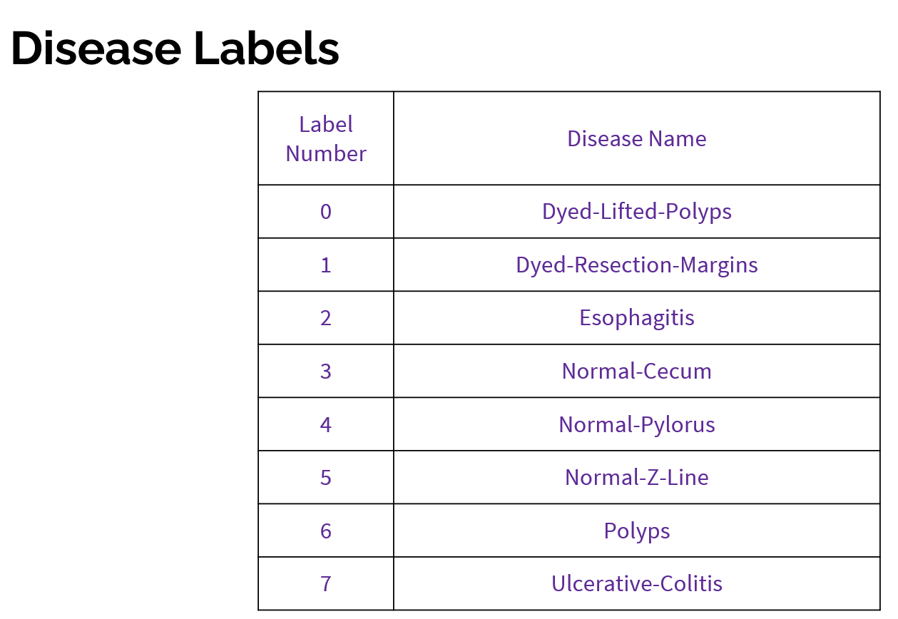
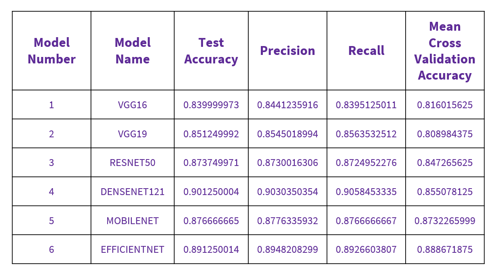

# Gastro-intestinal-Disease-Prediction

Gastrointestinal (GI) diseases are prevalent and place a significant burden on healthcare systems, causing patient discomfort and potentially leading to serious health issues. Traditional diagnosis often involves invasive endoscopies, which are costly, time-consuming, and uncomfortable for patients.

This project aims to develop a non-invasive, image-based machine learning tool to classify GI diseases, assisting medical professionals in making faster and more accurate diagnoses. A successful system could enhance diagnostic accuracy, increase accessibility to expert knowledge, reduce the need for invasive endoscopies, and improve overall healthcare efficiency.

Our approach focuses on classifying GI diseases using endoscopic images, including:

- Dyed-Lifted-Polyps: Images of stained polyps for improved visualization, removed during endoscopy.
- Dyed-Resection-Margins: Images of tissue edges after polyp removal.
- Esophagitis: Images of inflammation or irritation of the esophagus.
- Normal-Cecum: Images of a healthy cecum.
- Normal-Pylorus: Images of a healthy pylorus.
- Normal-Z-Line: Images of a healthy z-line.
- Polyps: Images of growths on the colon or rectum lining.
- Ulcerative-Colitis: Images of inflammation and ulcers in the colon and rectum.

We utilize the KVASIR dataset, which contains 4000 images (500 images per disease class), for training our model. The images vary in size, so we resize them to ensure reproducibility. Additionally, we convert images from BGR to RGB format using the cv2.COLOR_BGR2RGB function in Python, meeting our model's input requirements.

For more information about the KVASIR dataset, visit this https://www.kaggle.com/datasets/meetnagadia/kvasir-dataset/data

Currently, I am also working on generating reports in PDF format and creating a website to make these tools and reports easily accessible to users.

Model One - VGG16
Base Model: Utilizes VGG16, a powerful pre-trained convolutional neural network.

Architecture:

- Input: 224x224 RGB image
- Convolutional Blocks:
    - Multiple convolutional layers (with 3x3 filters)
    - Max-pooling layers for downsampling
- Fully Connected Layers:
    - Layers to map the extracted features to the final output classes
- Output: 1000-dimensional vector (corresponding to 1000 ImageNet classes)
- Total Parameters: 33,989,210
- Trainable Parameters: 6,424,840
- Non-trainable Parameters: 14,714,688

Model Two - VGG19
- Base Model: Utilizes VGG19, a powerful pre-trained convolutional neural network.
- Additional Layers:
- Flatten Layer: Converts the multi-dimensional output of a convolutional or pooling layer into a one-dimensional array or vector.
- Dense Layer: Computes a weighted sum of its inputs from the previous layer, adds a bias term, and then applies an activation function.
- Dropout: Prevents overfitting by randomly deactivating some units during training.
- Total Parameters: 26,449,224
- Trainable Parameters: 6,424,840
- Non-trainable Parameters: 20,024,384

Model Three - RESNET50
- Base Model: Utilizes ResNet50, a powerful pre-trained convolutional neural network.
- Additional Layers:
- Flatten Layer: Converts the multi-dimensional output of a convolutional or pooling layer into a one-dimensional array or vector.
- Dense Layer: Computes a weighted sum of its inputs from the previous layer, adds a bias term, and then applies an activation function.
- Dropout: Prevents overfitting by randomly deactivating some units during training.
- Total Parameters: 100,664,986
- Trainable Parameters: 25,692,424
- Non-trainable Parameters: 23,587,712

Model Four - DENSENET121
- Base Model: Utilizes DenseNet121, a powerful pre-trained convolutional neural network.
- Additional Layers:
- GlobalAveragePooling2D: Reduces spatial dimensions while retaining important information.
- Dense Layer: Adds non-linearity to the model with 256 units and ReLU activation function.
- Dropout: Prevents overfitting by randomly deactivating some units during training.
- Total Parameters: 7,830,874
- Trainable Parameters: 264,456
- Non-trainable Parameters: 7,037,504

Model Five - MOBILENET
- Base Model: Utilizes MobileNet, a powerful pre-trained convolutional neural network optimized for mobile applications.
- Additional Layers:
Global Average Pooling Layer: Reduces each of the incoming feature map's dimensions to a single value, condensing the spatial - information, thus lowering the model's complexity and total parameter count.
- Dense Layer: Computes a weighted sum of its inputs from the previous layer, adds a bias term, and then applies an activation function.
- Dropout: Prevents overfitting by randomly deactivating some units during training.
- Total Parameters: 3,493,320
- Trainable Parameters: 264,456
- Non-trainable Parameters: 3,228,864

Model Six - EFFICIENTNET
Base Model: Utilizes EfficientNet_B2, a powerful pre-trained convolutional neural network optimized for classification of larger - datasets.
- Additional Layers:
Global Average Pooling Layer: Reduces each of the incoming feature map's dimensions to a single value, condensing the spatial - information, thus lowering the model's complexity and total parameter count.
- Dense Layer: Computes a weighted sum of its inputs from the previous layer, adds a bias term, and then applies an activation function.
- Dropout: Prevents overfitting by randomly deactivating some units during training.
- Total Parameters: 8,131,329
- Trainable Parameters: 362,760
- Non-trainable Parameters: 7,768,569

Summary 

Observations
- Misclassifications Analysis:
- Misclassifications primarily occur between classes with similar visual features. For instance, Dyed-Lifted-Polyps (Class 0) and Dyed-Resection-Margins (Class 1) often share similar color and texture once stained, leading to confusion.
- The varying shades and inflammation levels in Esophagitis (Class 2) can resemble the normal tissue appearance, causing confusion with the Normal-Z-Line (Class 5).
- Ulcerative-Colitis (Class 7) can sometimes present with less pronounced visual symptoms, leading to misidentification as Normal-Cecum or Polyps (Class 6), depending on the severity and imaging clarity.

Model-Specific Performance:
- VGG16: Has shown commendable performance in identifying Normal-Cecum (Class 3), with high correct predictions and fewer misclassifications.
- VGG19: Has excelled in accurately classifying Normal-Cecum (Class 3) and Normal-Pylorus (Class 4), evidenced by its almost perfect prediction rate.
- ResNet50: Has demonstrated strong performance across most classes, with particularly high accuracy for Normal-Cecum (Class 3) and Normal-Pylorus (Class 4).
- DenseNet121: Stands out in its ability to distinguish between Normal-Cecum (Class 3), Normal-Pylorus (Class 4), and Ulcerative-Colitis (Class 7) with high accuracy.
- MobileNet: Offers the best performance for Normal-Pylorus (Class 4) and Ulcerative-Colitis (Class 7), indicating its strength in differentiating subtle textural differences.
- EfficientNet: Shows an impressive ability to correctly classify Dyed-Lifted-Polyps (Class 0), suggesting it might be best for datasets where this class is predominant.

Overall Best Model Considerations:
- No single model uniformly outperforms others across all classes; thus, the choice of model may depend on the specific clinical requirements and the prevalence of certain conditions in the target population.
- Ensemble methods that combine predictions from multiple models might be explored to leverage the strengths of individual models, potentially leading to better overall accuracy and robustness.

Conclusion:
- Our comparative analysis of six models on the KVASIR dataset for gastrointestinal disease prediction has yielded important insights:
- Misclassifications occurred mostly between classes with similar visual characteristics, suggesting a need for improved feature extraction methods.
- Some models have exhibited strength in specific classes.
- Overall, no single model outperformed the others across all disease classes. The choice of the model should be informed by the specific clinical needs and the prevalence of diseases in the patient population.
- The findings advocate for the potential of using machine learning as a support tool in gastroenterology, promising enhancements in diagnosis accuracy and patient care.

